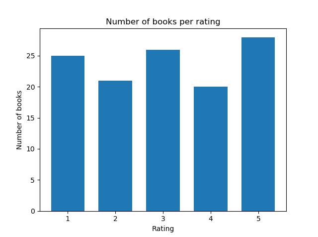
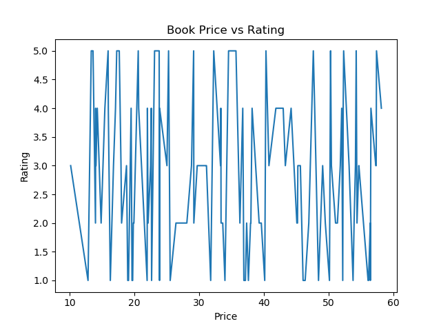
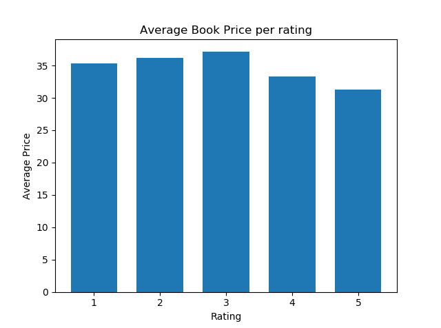

# Data Scraping and Analysis on e-commerce book website (Python, bs4, SQL)
### Above is the code I used to scrape the data. Below is a description of my project along with graphs describing the data I scraped
- Developed a program in Python to scrape data from an e-commerce book website, specifically product names, prices and ratings
- Designed and implemented databases in SSMS for the purpose of descriptive statistical analysis, data cleansing and data analysis
- Below you can find my code and graphs


### 1. Code
```python
#importing
from bs4 import BeautifulSoup
import requests
import pandas as pd
#Here I chose the first 6 pages
pages = ["http://books.toscrape.com/",
         "http://books.toscrape.com/catalogue/page-2.html",
         "http://books.toscrape.com/catalogue/page-3.html",
         "http://books.toscrape.com/catalogue/page-4.html",
         "http://books.toscrape.com/catalogue/page-5.html",
         "http://books.toscrape.com/catalogue/page-6.html"]
prices=[]
products=[]
ratings=[]
ident=[]
r=[]
#parsing
for i in pages:
    page = requests.get(i)
    soup = BeautifulSoup(page.content, 'html.parser')
 
#class is 'col-xs-6 col-sm-4 col-md-3 col-lg-3'
#Now, we can use the find_all method to search for items by class 
#In our case, we are looking for all li elements with this specific class.
#after that, we can find specific objects by specifing the tag or class, and then use get text to get the price and name. 
#for the rating I just used p['class'] since the rating was the class already, however it also had the numbers worded so I had to #convert the words into integers using if statements, it also had lists within lists so I had to choose the right element

    for a in soup.find_all('li', class_='col-xs-6 col-sm-4 col-md-3 col-lg-3'):
        product_price=a.find(class_="price_color")
        product_name=a.find('h3')
        product_rating=a.p['class']
        price=product_price.get_text().strip().strip('£')
        name=product_name.get_text()
        prices.append(price)
        products.append(name)
        ratings.append(product_rating)
    
for i in range(0, len(prices)):
	ident.append(i)
#since ratings had lists within lists 
for i in range(0, len(ratings)):
    r.append(ratings[i][1])

for i in range(0, len(ratings)):
    if r[i]=='One':
        r[i]=1
    elif r[i]=='Two':
        r[i]=2
    elif r[i]=='Three':
        r[i]=3
    elif r[i]=='Four':
        r[i]=4
    elif r[i]=='Five':
        r[i]=5

df = pd.DataFrame({'id':ident,'Product Name':products,'Price':prices, 'Rating':r}) 
df.to_csv('all.csv', index=False, encoding='utf-8')

```

### 2. Graphs




