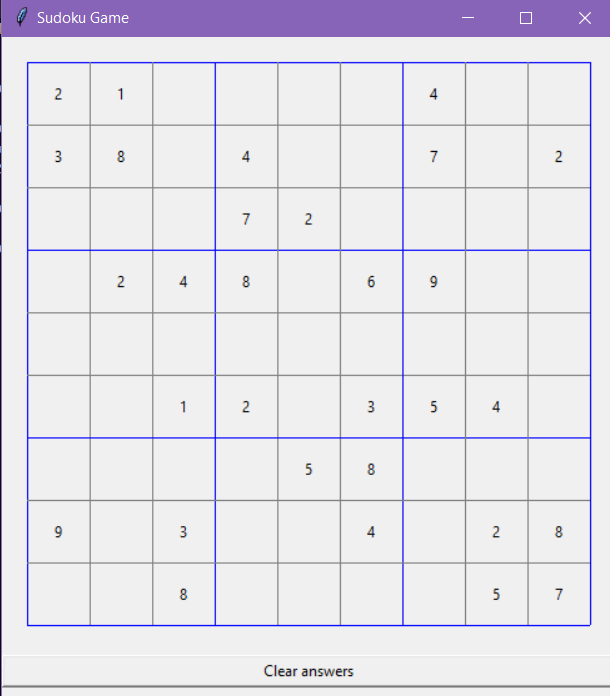
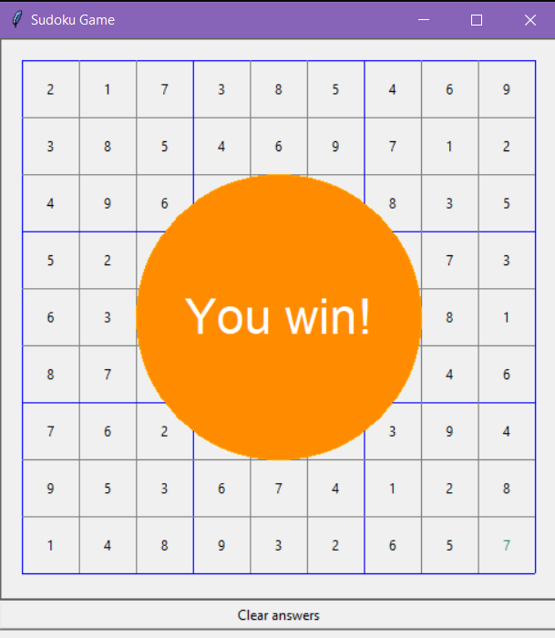

# Sudoku Game and Solver (Python, tkinter)
### Below is the code I used for this project, both the Solver and interactive game code is shown. Below is a description of my project.
- One can run both of the programs by going into the command line and typing "SudokuGame.py --board n00b" or "SudokuSolver.py --board n00b" where n00b is a .sudoku file included above
- Created a sudoku game that allows the user to play by interacting with a graphical user interface
- Designed a sudoku solver using a backtracking algorithm to solve newly generated games
- Below is a screenshot of the game with a clear board
<br /> 

### 1. Game Screenshots





### 2. Below is the code for the Game

``` python

import argparse

from tkinter import Tk, Canvas, Frame, Button, BOTH, TOP, BOTTOM

BOARDS = ['debug', 'error', 'n00b']  # Available sudoku boards
MARGIN = 20  # Pixels around the board
SIDE = 50  # Width of every board cell.
WIDTH = HEIGHT = MARGIN * 2 + SIDE * 9  # Width and height of the whole board


class SudokuError(Exception):
    """
    An application specific error.
    """
    pass


def parse_arguments():
    """
    Parses arguments of the form:
        sudoku.py <board name>
    Where `board name` must be in the `BOARD` list
    """
    arg_parser = argparse.ArgumentParser()
    arg_parser.add_argument("--board",
                            help="Desired board name",
                            type=str,
                            choices=BOARDS,
                            required=True)

    # Creates a dictionary of keys = argument flag, and value = argument
    args = vars(arg_parser.parse_args())
    return args['board']


class SudokuUI(Frame):
    """
    The Tkinter UI, responsible for drawing the board and accepting user input.UI is User Interface
    Frame is defined as a “rectangular region on the screen”. This is essentially just a widget of our puzzle
    """
    def __init__(self, parent, game):
        self.game = game
        Frame.__init__(self, parent)
        self.parent = parent

        self.row, self.col = -1, -1

        self.__initUI()

    def __initUI(self): 
        '''
        This private method of the SudokuUI class is the logic that sets up the actual user interface.
        '''
        self.parent.title("Deez Nutz")
        self.pack(fill=BOTH )
        '''Next is the canvas attribute. canvas is a general-purpose widget that we will use to display our board. 
        We will use the earlier-defined global variables'''
        self.canvas = Canvas(self, width=WIDTH, height=HEIGHT)
        self.canvas.pack(fill=BOTH, side=TOP)
        clear_button = Button(self,
                              text="Clear answers",
                              command=self.__clear_answers)
        clear_button.pack(fill=BOTH, side=BOTTOM)


        self.__draw_grid()
        self.__draw_puzzle()
        '''So here, when the user clicks on the puzzle with a single left-click of the mouse, 
our UI will call __cell_clicked function, which we will define in a bit.
The bind method will actually pass in the x and y location of the cursor, 
which in __cell_clicked we will turn into actual cells of the puzzle.'''
        self.canvas.bind("<Button-1>", self.__cell_clicked)
        self.canvas.bind("<Key>", self.__key_pressed)

    def __draw_grid(self):
        """
        Draws grid divided with blue lines into 3x3 squares
        """
        for i in range(10):
            color = "blue" if i % 3 == 0 else "gray"
#creates column
            x0 = MARGIN + i * SIDE
            y0 = MARGIN
            x1 = MARGIN + i * SIDE
            y1 = HEIGHT - MARGIN
            self.canvas.create_line(x0, y0, x1, y1, fill=color)
#creates row
            x0 = MARGIN
            y0 = MARGIN + i * SIDE
            x1 = WIDTH - MARGIN
            y1 = MARGIN + i * SIDE
            self.canvas.create_line(x0, y0, x1, y1, fill=color)

    '''The __draw_puzzle private method then draws the puzzle by filling in the cells 
with the pre-filled numbers defined in whatever .sudoku board we pass in.
We first call delete on the canvas to clear out any previous numbers. 
This is helpful for when the user wants to clear out the puzzle and start over.
We then iterate over rows and columns, and create a cell. 
We then grab the same X & Y location of the cell from the game’s puzzle. 
If it isn’t zero, then fill it in with the appropriate number, otherwise just leave it blank.'''


    def __draw_puzzle(self):
        self.canvas.delete("numbers")
        for i in range(9):
            for j in range(9):
                answer = self.game.puzzle[i][j]
                if answer != 0:
                    x = MARGIN + j * SIDE + SIDE / 2
                    y = MARGIN + i * SIDE + SIDE / 2
                    original = self.game.start_puzzle[i][j]
                    color = "black" if answer == original else "sea green"
                    self.canvas.create_text(
                        x, y, text=answer, tags="numbers", fill=color
                    )

    def __draw_cursor(self):
        self.canvas.delete("cursor")
        if self.row >= 0 and self.col >= 0:
            x0 = MARGIN + self.col * SIDE + 1
            y0 = MARGIN + self.row * SIDE + 1
            x1 = MARGIN + (self.col + 1) * SIDE - 1
            y1 = MARGIN + (self.row + 1) * SIDE - 1
            self.canvas.create_rectangle(
                x0, y0, x1, y1,
                outline="red", tags="cursor"
            )

    def __draw_victory(self):
        # create a oval (which will be a circle)
        x0 = y0 = MARGIN + SIDE * 2
        x1 = y1 = MARGIN + SIDE * 7
        self.canvas.create_oval(
            x0, y0, x1, y1,
            tags="victory", fill="dark orange", outline="orange"
        )
        # create text
        x = y = MARGIN + 4 * SIDE + SIDE / 2
        self.canvas.create_text(
            x, y,
            text="You win!", tags="victory",
            fill="white", font=("Arial", 32)
        )

    def __cell_clicked(self, event):
        if self.game.game_over:
            return
        x, y = event.x, event.y
        if (MARGIN < x < WIDTH - MARGIN and MARGIN < y < HEIGHT - MARGIN):
            self.canvas.focus_set()

            # get row and col numbers from x,y coordinates
            row, col = (y - MARGIN) / SIDE, (x - MARGIN) / SIDE

            # if cell was selected already - deselect it
            if (row, col) == (self.row, self.col):
                self.row, self.col = -1, -1
            elif self.game.puzzle[int(row)][int(col)] == int(0):
                self.row, self.col = int(row), int(col)
        else:
            self.row, self.col = -1, -1

        self.__draw_cursor()

    def __key_pressed(self, event):
        if self.game.game_over:
            return
        if self.row >= 0 and self.col >= 0 and event.char in "1234567890":
            self.game.puzzle[int(self.row)][int(self.col)] = int(event.char)
            self.col, self.row = -1, -1
            self.__draw_puzzle()
            self.__draw_cursor()
            if self.game.check_win():
                self.__draw_victory()

    def __clear_answers(self):
        self.game.start()
        self.canvas.delete("victory")
        self.__draw_puzzle()


class SudokuBoard:
    """
    Sudoku Board representation: so first the board is read line by line and made into a "matrix"
    can be done from a text file but the arg gives the user the choice to choose a board, so we use a .sudoku file.  
    
    """
    def __init__(self, board_file):
        self.board = self.__create_board(board_file)

    def __create_board(self, board_file):
        board = []
        for line in board_file:
            line = line.strip()
            if len(line) != 9:
                raise SudokuError(
                    "Each line in the sudoku puzzle must be 9 chars long."
                )
            board.append([])

            for c in line:
                if not c.isdigit():
                    raise SudokuError(
                        "Valid characters for a sudoku puzzle must be in 0-9"
                    )
                board[-1].append(int(c))

        if len(board) != 9:
            raise SudokuError("Each sudoku puzzle must be 9 lines long")
        return board


class SudokuGame:
    """
 A Sudoku game, in charge of storing the state of the board and checking
whether the puzzle is completed.In start(), we set a flag, self.game_over, to False. 
When the user plays the game and correctly solves it, we’ll set it to True.
We create a copy of the puzzle for two reasons: 
to create the functionality of clearing the board when the user wants to start over, 
as well as to check the inputted answers against the start board. checkwin basically just checks whether the
row, column, and square meet the check block condition which makes sure the sets are equal to the set from 1 through 9
if so, then it sets self.game_over to true'''
    """
    def __init__(self, board_file):
        self.board_file = board_file
        self.start_puzzle = SudokuBoard(board_file).board
    def start(self):
        self.game_over = False
        self.puzzle = []
        for i in range(9):
            self.puzzle.append([])
            for j in range(9):
                self.puzzle[i].append(self.start_puzzle[i][j])
        #print(self.puzzle)# self.puzzle is the new copy of the puzzle that gets written over
    def check_win(self):
        for row in range(9):
            if not self.__check_row(row):
                return False
        for column in range(9):
            if not self.__check_column(column):
                return False
        for row in range(3):
            for column in range(3):
                if not self.__check_square(row, column):
                    return False
        self.game_over = True
        return True

    def __check_block(self, block):
        return set(block) == set(range(1, 10)) #basically makes into a set, so youre checking if the sets are equal, returns true or false

    def __check_row(self, row):
        #print(self.puzzle[row])
        return self.__check_block(self.puzzle[row]) #sef.puzzle is the board we are building or SudokuUI.game.puzzle

    def __check_column(self, column):
        #print([self.puzzle[int(row)][int(column)] for row in range(9)])
        return self.__check_block(
            [self.puzzle[int(row)][int(column)] for row in range(9)]
        )

    def __check_square(self, row, column):
        return self.__check_block(
            [
                self.puzzle[r][c]
                for r in range(row * 3, (row + 1) * 3)
                for c in range(column * 3, (column + 1) * 3)
            ]
        )
'''This is the step where the argument we put in is parsed
 so that the appropiate file is opened '''

if __name__ == '__main__':
    board_name = parse_arguments() 

    with open('%s.sudoku' % board_name, 'r') as boards_file:

        game = SudokuGame(boards_file)
        game.start()
        #game.start_puzzle
        #g= SudokuBoard(boards_file)
        #print(g.board)
        #SudokuGame(boards_file).start_puzzle
        #print(game.start_puzzle )
        root = Tk()
        SudokuUI(root, game)
        root.geometry("%dx%d" % (WIDTH, HEIGHT + 40))
        root.mainloop()
        
```
