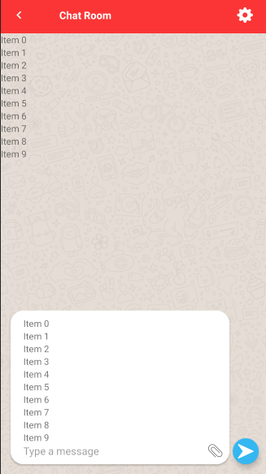

# Android-Chat-Application (Java, Android Studio, Firebase)
### Below is a link to the github project with all the Java code I implemented for this application in AndroidStudio, and below is a description of my project
[github project link](https://github.com/salazarbrandon1257/Android-Chat-Application)
-	Developed and published android app on Google Play Store that allows users to chat with each other 
-	Implemented Firebase (authorization, databases), and designed User Interface 
- Below are screenshots of the app

